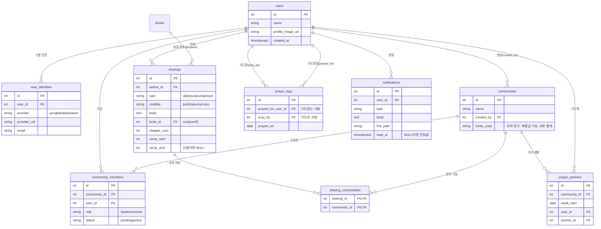

# ERD (데이터 모델)

Manna의 전체 데이터 모델. 성경 3테이블(books/chapters/verses)은 이미 있었고, 여기에 사용자·공동체·나눔·기도·알림 9테이블을 얹었다.

- **실제 스키마:** `apps/init-db.sql` — 이 문서와 컬럼·제약이 일치한다. 스키마가 진실이고 이 문서는 설명이다.
- **화면 근거:** `docs/design/screens/`
- **검증:** 임시 Postgres에 부어 화면 시나리오 6종이 돌고 나쁜 데이터 13종이 제약에 막히는 것을 확인했다.

## 다이어그램



## 테이블

| 테이블 | 역할 | 핵심 제약 |
|---|---|---|
| `users` | 사용자 프로필 | — |
| `user_identities` | 소셜 로그인 | `UNIQUE(provider, provider_uid)`. 한 user가 여러 provider 연결 |
| `communities` | 공동체 | `created_by → users`, `UNIQUE(invite_code)` |
| `community_members` | 소속 | `UNIQUE(community_id, user_id)`, role leader/member, status pending/active |
| `sharings` | 나눔 | type/visibility CHECK, 성경참조 전부-또는-전무 CHECK, 절 범위 CHECK |
| `sharing_communities` | 나눔↔공동체 (다대다) | 복합 PK |
| `prayer_logs` | "기도했어요" | `UNIQUE(prayed_for, pray_by, prayed_on)`, 자기참조 금지 |
| `prayer_partners` | 기도짝 | `UNIQUE(community_id, week_start, user_id)`, 자기참조 금지 |
| `notifications` | 알림 | `read_at IS NULL` = 안읽음(부분 인덱스) |

## 설계 결정과 근거

화면만 봐서는 안 나오는, 관계를 좌우한 판단들이다.

### 공동체는 계층 없이 평평하다
화면에 "푸른교회 수도권지부", "2026-2기 수요 새가족반"처럼 계층이 보이지만, `parent_id`를 두지 않는다. 카톡 단톡방처럼 **생성 시 이름을 짓고 모임장이 바꾸는** 모델이다. 교회-지부-반 3단계가 확정된 요구가 아니라, 지금 트리를 넣으면 안 쓰는 복잡도만 생긴다. 필요해지면 `parent_id` 한 컬럼으로 자기참조 트리를 나중에 얹는다.

### 가입은 초대 링크 + 리더 승인을 거친다
기도제목은 이 앱에서 가장 사적인 데이터라 **링크를 주운 사람이 그대로 들어오면 안 된다**(D-1004, D-1707). 그래서 컬럼 둘이 붙는다.

- **`communities.invite_code`** — 링크가 곧 코드다. **`id`와 별개인 이유는 재발급 때문이다**: 코드를 방 ID로 쓰면 재발급이 곧 방을 새로 만드는 일이 되고, `id`를 FK로 참조하는 `community_members`·`sharing_communities`·`prayer_partners`가 전부 깨진다. 만료는 두지 않고 **재발급만** 한다(D-1708) — 승인이 있으면 코드 유출의 피해가 "가입 신청이 하나 뜬다"로 줄어들기 때문이다.
- **`community_members.status`** — `pending`은 방 내용을 **하나도** 못 본다. 그것이 승인의 존재 이유다. 리더는 `created_by`가 자동으로 `role='leader'`이며, 위임·복수 리더는 MVP에서 제외한다.
- ⚠️ **`status` DEFAULT가 `'pending'`이라 생성자도 그대로 두면 자기 방에 갇힌다.** 공동체 생성 시 리더 행은 `status='active'`, `role='leader'`를 명시적으로 넣는다.
- 주소가 둘로 나뉜다 — `/invite/{code}`는 코드로 방을 찾고, `/communities/{id}`는 멤버가 쓴다. `id`가 순차 정수로 노출돼도 승인 전에는 아무것도 보이지 않아 MVP에서는 문제가 아니다.

### 기도 카운트는 "사람 기준 + 하루 하나"다 (제목 기준 아님)
가장 중요한 결정. "기도했어요"의 단위가 **기도제목이 아니라 사람**이다.

- **근거:** 기도 상세 화면(`Pray Page - Detail`)의 "기도했어요" 버튼은 사람 카드(김현정)에 **하나** 붙어 있다. 그 사람의 기도제목 4개는 카드 안 내용일 뿐, 제목마다 버튼이 있지 않다.
- **왜 제목 기준(좋아요식)이 아닌가:** 제목별로 좋아요를 쌓으면 인기 제목에 기도가 몰리고 조용한 사람은 0에 머문다 — 중보기도의 취지와 어긋난다. 사람 기준이면 모두가 공평히 기도받는다.
- **그래서 `prayer_logs` 키가 `(prayed_for_user_id, pray_by, prayed_on)`이다.** 한 사람을 하루 한 번, 매일 리셋. `sharing_id`는 아예 없다 — 어느 제목을 보고 눌렀는지 기록하지 않기로 했다.
- **카운트 파생:** "어제 N명이 날 위해 기도했어요" =
  ```sql
  SELECT count(*) FROM prayer_logs
   WHERE prayed_for_user_id = :me AND prayed_on = :yesterday;
  ```
  전날 기준인 이유: 오늘은 아직 쌓이는 중이라 완결된 어제를 보여준다(싸이월드 투데이의 직전일 버전).
- **집중모드 "이미 기도한 사람 건너뛰기"**도 이 키로 성립한다 — 오늘 `pray_by=나`인 로그가 없는 사람만 남긴다. 로그 없이 카운트만 뒀다면 이게 불가능했다.

### 기도제목 = prayer 타입 나눔, 최신 하나만 노출
별도 `prayers` 테이블을 두지 않는다. 저장하는 것이 나눔과 같은 모양(작성자 + 본문 + 공개 여부)이기 때문이다. 기도제목은 `sharings(type='prayer')`이고, 기도 상세는 그 사람의 **최신** prayer 나눔만 보여준다:
```sql
SELECT * FROM sharings WHERE author_id = :who AND type = 'prayer'
 ORDER BY created_at DESC LIMIT 1;
```
append-only라 이력은 남고, "최신만"은 조회 시점의 규칙이다. 여러 기도제목이 좋아요처럼 병렬로 쌓이지 않는다.

그래서 **화면의 말은 "수정"이 아니라 "업데이트"다**(D-1706). 편집 폼에 기존 내용을 채워 열고 저장하면 새 행이 생기므로 사용자에게는 이어지는 하나로 보이고, `created_at`이 갱신돼 카드의 "○일 전"이 저절로 맞는다. 1:1 UPDATE로 바꾸지 않은 이유는 이력을 잃기 때문이다 — 본인만 보는 기도제목 이력 화면은 MVP에서 빼지만 데이터는 이미 쌓인다.

### 나눔↔공동체는 다대다
나눔 작성 화면에 공동체 체크박스가 여러 개다(수요 새가족반 + 푸른교회 수도권지부). 슬랙에서 한 메시지를 여러 채널에 크로스포스트하듯, 한 나눔을 여러 방에 공유한다. `sharing_communities` 조인 테이블.

⚠️ **기도제목(`type='prayer'`)은 방을 고르지 않는다**(D-2301). 기도제목은 내 카드 하나고, 정하는 것은 어느 방에 걸지가 아니라 그 카드를 남들에게 보일지 말지(`visibility`)다. 저장 시점에 백엔드가 **내 active 공동체 전부**를 `sharing_communities`에 채운다 — 조인 테이블은 그대로 쓰되 값이 선택이 아니라 파생이다. 중보기도실에 공동체 드릴다운이 없고(D-904) `prayer_logs`에 `community_id`가 없는 것과 같은 방향이다: 기도는 방 단위가 아니라 사람 단위다.

### 나눔 타입 3종, 필드 유무가 타입에 달림
`daily`(일상) / `scripture`(성경) / `prayer`(기도제목). 성경 참조 4컬럼은 scripture에만, 공개/익명은 prayer에만 의미가 있다. `sharings_scripture_ref` CHECK가 "성경 참조는 전부 있거나 전부 없어야 한다"를 강제해 부분 참조를 막는다.

### 기도짝은 방향이 있는 주간 매칭
`(community_id, week_start, user_id)`가 유니크 — 한 공동체에서 한 주에 한 사람은 기도짝 하나. `user_id → partner_id`는 방향이 있고, 상호 매칭이면 두 행을 넣는다. 스케줄러가 주마다 생성한다(로드맵 Phase 3).

## 의도적 제외

- **성경 읽기 진도(last-read):** 테이블로 만들지 않는다. 이미 프론트에서 쿠키로 구현돼 있고(`apps/frontend/src/features/bible/last-read.ts`), 서버 계정에 묶을 이유가 아직 없다. 기기 간 동기화가 요구되면 그때 `user_reading_progress(user_id, book_id, chapter_num, updated_at)`를 얹는다.
- **좋아요/댓글:** 이 14개 화면에 나눔 좋아요·댓글 UI가 없다. 반응은 기도(prayer_logs)가 대신한다. 필요해지면 별도 테이블로 추가.
- **오늘의 말씀(@dailymayim):** 메인의 "오늘의 말씀"은 외부 채널 인용으로 보인다. 자체 콘텐츠가 아니면 테이블이 아니라 설정/피드 연동 문제다. 출처가 확정되면 재검토.

## API 명세 대응

`03_API_SPEC.md`의 엔드포인트가 어느 테이블을 다루는지:

| 엔드포인트 | 테이블 |
|---|---|
| `GET/POST /communities`, `GET/PATCH /communities/{id}` | `communities`, `community_members` |
| `GET /invites/{code}`, `POST /invites/{code}/requests` | `communities.invite_code` → `community_members(status='pending')` |
| `POST /communities/{id}/invite-code` | `communities.invite_code` (재발급) |
| `POST /communities/{id}/members/{userId}/approve` | `community_members.status` → `'active'` |
| `DELETE /communities/{id}/members/{userId}` | `community_members` 행 삭제 (거절·강퇴·나가기 공용) |
| `GET/POST /pray/requests/me`, `GET /pray/requests/{userId}` | `sharings(type='prayer')`, `sharing_communities` |
| `GET /pray/room` | `community_members` + `sharings` + `prayer_logs` (정렬) |
| `POST /pray/{userId}` | `prayer_logs` |
| `GET /pray/summary` | `prayer_logs` (어제 집계) |
| `GET /communities/{id}`의 `prayerPartner`(그 방의 짝) · `GET /pray/summary`의 `partner`(내 짝 중 하나) · `GET /pray/room`의 `partners` 구획 — 셋 다 Phase 3까지 빈다 | `prayer_partners` |
| `POST /sharings`, `GET /sharings?communityId=` (초안, Phase 3) | `sharings`, `sharing_communities` |
| (로그인) | `users`, `user_identities` |
| (알림 배지) | `notifications` |

**✅ 해결됨** — 초안의 `POST /prayers/{id}/pray`는 `{id}`가 기도제목을 가리켜 기도의 단위(사람)와 어긋났다. `POST /pray/{userId}`로 바로잡았다. 아울러 **기도제목(`sharings`)과 기도 행위(`prayer_logs`)는 경로에서도 갈라 둔다** — `/pray/requests/...`와 `/pray/{userId}`. 한 이름에 두 뜻을 담으면 `/prayers/{userId}/pray` 같은 주소가 나온다.
