# 유저 플로우

사용자가 **어떤 순서로 화면을 지나가는지**. 다른 문서가 이미 나눠 갖고 있는 것과 겹치지 않는다 —
05(무엇을 만드나) · 06(무엇을 저장하나) · 03(무엇을 주고받나) · 07(왜 그렇게 정했나).
**빠져 있던 것은 "사이"다.**

> 화면이 어떻게 생겼는지는 `docs/design/screens/` 시안이 말한다. 이 문서는 **전이와 조건**을
> 말한다 — 빈 상태, 권한, 되돌아가는 길, 아직 정하지 않은 것. 시안이 못 그리는 것들이다.

## 기호

| 기호 | 뜻 |
|---|---|
| ⛔ | 지금 막혀 있다. 무엇을 기다리는지 함께 적는다 |
| ❓ | **아직 안 정했다.** 이 문서를 읽으며 채울 칸 |
| ⚠️ | 어긋나 있다 — 시안과 코드가, 또는 결정과 코드가 |

`⛔`와 `❓`만 grep하면 남은 일이 한눈에 나온다.

---

## 전체 지도

**기능 덩어리로 묶고, 왼쪽에서 오른쪽으로 읽는다.** 묶는 기준은 앱이 이미 쓰고 있는 것 그대로다 —
`lib/brand.ts`의 **톤**(cool=성경 · love=기도 · warm=나머지)이 곧 기능 구분이다(D-2203).
덩어리가 바뀌는 이동은 **문서 전체가 새로 뜬다**(`ToneNavigation`, 아래 ⚠️).

- **실선** = 코드에 실제로 있는 이동 · **점선** = 문서·시안에만 있고 **라우트가 없는 것**
- **마름모** = 조건 분기 · **⛔** = 막힘 · **❓** = 미정
- 되돌아가는 길은 그리지 않았다 (오른쪽→왼쪽으로 꺾여 흐름을 가린다). 아래 표에 따로 있다

```mermaid
flowchart LR
    %% ═══════════ 진입 ═══════════
    subgraph ENTRY[" 진입 "]
        direction TB
        OPEN(["앱 열기<br/>start_url = /"])
        NAV(["하단 네비<br/>4탭 + ＋"])
        KAKAO(["카톡 초대 링크"])
        BADURL(["없는 주소"])
    end

    %% ═══════════ 인증 ═══════════
    subgraph AUTH[" 🔑 인증 · warm "]
        direction LR
        LANDING["/landing<br/>⚠️ 고아"]
        LOGIN["/login"]
        OAUTH["Spring<br/>/oauth2/*"]
        MYPAGE["/mypage<br/>마이페이지"]
        LANDING -.->|"1800ms"| LOGIN
        LOGIN -->|"Google"| OAUTH
        MYPAGE -->|"로그아웃 POST /logout"| LOGIN
    end

    %% ═══════════ 홈 ═══════════
    subgraph HOMEG[" 🏠 홈 · warm "]
        HOME["/"]
        NF["404"]
    end

    %% ═══════════ 성경 ═══════════
    subgraph BIBLEG[" 📖 성경 · cool "]
        direction LR
        BIBLE["/bible"]
        RESUME{"이어읽기<br/>쿠키?"}
        READER["/bible/&#123;book&#125;/&#123;ch&#125;<br/>리더"]
        BIBLE --> RESUME
        RESUME -->|"있다"| READER
        RESUME -->|"없다 · 조작됨"| READER
        READER -->|"이전·다음 권 · 점프"| READER
    end

    %% ═══════════ 공동체 ═══════════
    subgraph COMG[" 👥 공동체 · warm "]
        direction LR
        INVITE["/invite/&#123;code&#125;<br/>⛔ 라우트 없음"]
        COMS["/communities<br/>목록"]
        MSTAT{"내 상태?"}
        CNEW["/communities/new"]
        CDETAIL["/communities/&#123;id&#125;<br/>대문"]
        COMS --> MSTAT
        MSTAT -->|"active"| CDETAIL
        MSTAT -->|"pending<br/>⛔ 누를 수 없다"| COMS
        COMS --> CNEW
        CNEW -->|"⛔ 만들기 · CSRF"| CDETAIL
    end

    %% ═══════════ 기도 ═══════════
    subgraph PRAYG[" 🙏 기도 · love "]
        direction LR
        PRAY["/prayer<br/>중보기도실"]
        PERSON["/prayer/&#123;userId&#125;<br/>한 사람"]
        DONE{"오늘 이미<br/>기도했나?"}
        REQS["/prayer/requests<br/>이전 기도제목"]
        RNEW["/prayer/requests/new<br/>기도제목 작성"]
        PRAY --> PERSON
        PERSON --> DONE
        DONE -->|"아니오"| PRAYED["⛔ 기도했어요<br/>CSRF"]
        DONE -->|"예"| SAID["오늘 이미<br/>기도했어요"]
        PRAY --> RNEW
        PRAY --> REQS
        RNEW -->|"⛔ 올리기 · CSRF"| POSTED["❓ 착지점"]
    end

    %% ═══════════ 나눔 ═══════════
    subgraph SHAREG[" ✍️ 나눔 · warm "]
        direction LR
        PLUS(["＋ 버튼"])
        TYPE{"어떤 나눔?"}
        SNEW["/sharings/new<br/>나눔 작성"]
        NOSHARE["나눔 목록 · 상세<br/>⛔ 라우트 없음"]
        PLUS --> SNEW
        SNEW --> TYPE
        TYPE -->|"일상 · 성경"| SNEW
        SNEW -->|"⛔ 공유하기 · CSRF"| NOSHARE
    end

    %% ═══════════ 덩어리 사이 ═══════════
    OPEN --> HOME
    BADURL --> NF
    KAKAO -.-> INVITE

    NAV --> HOME
    NAV --> BIBLE
    NAV --> COMS
    NAV --> PRAY
    NAV --> PLUS

    HOME -->|"기도 요약 3줄"| PRAY
    HOME -->|"최근 읽은 말씀<br/>쿠키 있을 때만"| READER
    HOME -->|"프로필 · 미로그인"| LOGIN
    HOME -->|"프로필 이미지 · 로그인"| MYPAGE
    HOME -.->|"⛔ 지금 공동체에서는<br/>= 스텁, 링크 없음"| COMS

    NF --> HOME
    NF --> BIBLE

    OAUTH -.->|"❓ 복귀 주소 미정"| HOME
    INVITE -.->|"코드를 쿠키에 심고"| LOGIN
    INVITE -.->|"가입 신청 → pending"| COMS

    CDETAIL -->|"기도짝 기도제목 보기"| PERSON
    CDETAIL -->|"나눔 자료실 ＋"| SNEW
    CDETAIL -.->|"초대 링크 복사<br/>⛔ 받는 화면이 없어 404"| INVITE
    CDETAIL -.->|"⛔ 나눔 줄 = 링크 아님"| NOSHARE

    PLUS -.->|"❓ 시안은 2지선다 팝업"| RNEW
```

### 이 그림이 말하는 것

**한 덩어리 = 한 기능 = 한 톤.** 덩어리 안에서는 왼쪽에서 오른쪽으로 한 줄로 흐르고, 갈라지는
자리에만 마름모가 있다. 덩어리를 넘는 화살표만 세면 **화면 사이가 아니라 기능 사이의 이동**이
보인다 — 그게 실제로 비싼 이동이다(문서 전체가 새로 뜬다).

| 보이는 것 | 뜻 |
|---|---|
| **기도 덩어리가 가장 두껍다** (화면 4 · 분기 1) | 핵심 루프가 맞게 자리 잡았다 (D-801) |
| **나눔 덩어리의 오른쪽 끝이 ⛔** | 올리고 나면 갈 곳이 없다. 목록·상세 라우트가 통째로 없다 |
| **공동체 덩어리에 들어오는 화살표가 점선뿐** | `/invite/&#123;code&#125;`가 없어 **바깥에서 들어올 문이 막혀 있다** (F-2) |
| **홈에서 나가는 화살표 4개 중 1개가 점선** | "지금 공동체에서는"이 스텁이라 홈↔공동체가 한쪽으로만 뚫려 있다 |
| **`⛔ … CSRF`가 네 덩어리에 흩어져 있다** | 원인은 하나다. 켜면 네 곳이 동시에 열린다 (D-404) |

⚠️ **`ToneNavigation`이 모든 클릭을 가로챈다**(`components/ToneNavigation.tsx:37`). **덩어리를
넘는 이동**(홈→성경, 홈→기도, 공동체→기도)은 SPA가 아니라 `location.assign` **문서 이동**이 된다.
iOS standalone이 상태바 색을 문서 로드 때만 읽기 때문(D-2203). 같은 덩어리 안(`/prayer`→
`/prayer/22`)과 같은 톤끼리(홈↔공동체)는 그대로 빠르다.

### 되돌아가는 길

지도에 그리지 않았다 — 오른쪽에서 왼쪽으로 꺾여 흐름을 가린다. **standalone PWA에는 브라우저
뒤로가기가 없어서**(D-1505) 이 링크들이 화면 안에 있어야 한다.

| 화면 | 버튼 | 돌아가는 곳 |
|---|---|---|
| `/prayer/{userId}` | 돌아가기 | `/prayer` |
| `/prayer/requests` | 중보기도실로 돌아가기 | `/prayer` |
| `/prayer/requests/new` | 취소하기 | `/prayer` |
| `/communities/new` | 취소 | `/communities` |
| `/mypage` | 홈으로 돌아가기 | `/` 홈 — 탭이 아니라 홈 상단바에서 들어오는 화면이라 |
| `/sharings/new` | 취소 | **`/` 홈** — 탭이 아니라 ＋로 들어오는 화면이라 |
| 리더 `/bible/{book}/{ch}` | 좌·우하단 chevron | 되짚어 온 장 (D-1501~1511) |

**탭이 가리키는 화면에는 돌아가는 버튼이 없다** — 탭을 다시 누르면 되기 때문(D-1701).

---

# 기능별 플로우

각 플로우는 **한 줄짜리 태스크 플로우**로 시작한다 — 분기 없이, 일이 잘 풀렸을 때 지나가는 길.
분기·빈 상태·미정은 그 아래에 따로 적는다. 한 줄이 안 이어지면 그 기능은 아직 안 끝난 것이다.

---

## F-1. 처음 앱을 여는 사람

> 앱 열기 → `/` 홈 → 우상단 "로그인" → `/login` → Google → Spring OAuth → **❓ 복귀 주소 미정**

**진입**: 홈 화면 아이콘(매니페스트 `start_url: "/"`) 또는 주소창

1. `/` 홈이 그냥 뜬다. **로그인 검사가 없다** — `middleware.ts`가 없고 홈은 세션을 보지 않는다
2. 우상단 프로필만 "로그인"으로 보인다 (`features/auth/ProfileButton.tsx:38`)
3. 눌러서 `/login` → Google 버튼 → Spring `/oauth2/authorization/google`로 **문서 이동**
4. 돌아오면 같은 자리가 **프로필 이미지**로 바뀐다 — 이것이 로그인 성공의 **유일한 표시**다
   (Spring `defaultSuccessUrl("/")`로 홈에 떨어지고, 프론트에는 콜백 화면이 없다).
   누르면 `/mypage`이고 **로그아웃은 거기 있다**(D-2403)

⚠️ **이 자리가 2026-09-19까지 깨져 있었다.** 로그인·DB 저장은 되는데 `/api/v1/me`가 500이라
상단바가 계속 "로그인"으로 남았다(D-2402). 로그인이 됐는지 화면으로 확인할 때 **여기 말고
볼 곳이 없다**는 뜻이기도 하다.

**분기**: 없다. 미로그인도 홈·성경·기도·공동체를 전부 볼 수 있다(전부 목데이터·로컬 JSON이라
그려진다).
**빈 상태**: 첫 사용자는 "최근 읽은 말씀" 줄이 **아예 없다**(`app/page.tsx:57`). 홈에서 성경으로
갈 길이 하단 탭 하나뿐이 된다.
⚠️ **`/landing`은 아무 데서도 이어지지 않는다.** 주소를 직접 쳐야 보이는 고아 라우트다.
시안(`Landing Page.png`)은 "최신 버전 확인 중 (99%)" 프로그레스인데 코드는 1800ms 타이머다.

**❓ 정할 것**
- 로그인 뒤 **어디로 돌아오나**. 프론트에 콜백 페이지가 없고 복귀 주소는 Spring이 정한다
- 로그인을 **언제 요구하나**. 지금은 끝까지 요구하지 않는다 — 쓰기가 열리는 순간 어디선가는
  막아야 한다. 읽기까지 막을지, 쓰기만 막을지
- `/landing`을 살릴 것인가. 살린다면 무엇이 그리로 보내나(PWA `start_url`?)
- 카카오 — MVP 필수로 승격됐는데(D-1702) 콘솔 등록·비즈앱 심사가 남았다. 그때까지 버튼은
  "(준비 중)"

---

## F-2. 초대 링크로 들어오기 ⛔ **이 앱의 가장 큰 구멍**

> 카톡 링크 → `/invite/{code}` **⛔ 여기서 끊긴다** → 로그인 → 가입 신청 → `pending`
> → 리더 승인 → `/communities/{id}`

가입 경로는 초대 링크 **하나뿐**인데(D-1004, 공개 검색은 배제) **받는 쪽이 통째로 없다.**

1. 리더가 대문에서 초대 버튼 → `${origin}/invite/{code}`를 클립보드에 복사
   (`features/community/components/InviteButton.tsx:48`)
2. 카톡에 붙여넣어 보냄
3. 받은 사람이 누름 → ⛔ **404.** `/invite/[code]` 라우트가 없다

문서에는 전부 정해져 있다 — `GET /invites/{code}`(비로그인 미리보기) ·
`POST /invites/{code}/requests`(가입 신청) · `pending_invite` 쿠키 복귀(D-1005) ·
리더 승인(D-1707) · 코드는 만료 없이 재발급만(D-1708). **코드가 없을 뿐이다.**

**설계된 흐름**: `/invite/{code}` → 로그인 없이 **방 이름만** 확인 → 로그인 버튼이 코드를
쿠키에 심고 OAuth로 → 복귀 → **버튼을 한 번 더** 눌러 가입 신청(자동 가입은 잘못 누른 링크를
되돌릴 수 없다) → `pending` → 리더의 멤버 목록에 "승인 대기 N명" 배지 → 승인 → 입장

**❓ 정할 것**
- 언제 만드나. **쓰기 API 없이 화면만 먼저 세울 수 있는 부분**(방 이름 미리보기)이 있다
- 코드가 유효하지 않으면? 404로 보내나, "링크가 만료됐어요" 화면을 주나
- 이미 멤버인 사람이 링크를 다시 누르면? → 바로 대문으로 보내는 것이 자연스럽다
- `pending` 상태로 다시 누르면? 지금 목록에서 그 방은 **누를 수 없는 회색 줄**이다
  (`app/communities/page.tsx:66`)

---

## F-3. 공동체 만들고 사람 부르기

> 탭 "공동체" → `/communities` → "+ 만들기" → `/communities/new` → 이름 입력
> → **⛔ 만들기(CSRF)** → `/communities/{id}` → 초대 링크 복사 → 카톡

**진입**: 하단 탭 "공동체"

1. `/communities` — **개수와 무관하게 항상 목록을 거친다**(D-1001, D-1701).
   "1개면 자동 진입"은 두 번 반려됐다: 탭이 곧 목록이면 되돌아올 길을 따로 만들 필요가 없고,
   생성 진입점도 여기 있다
2. "+ 공동체 만들기" → `/communities/new`
3. 이름 입력 → ⛔ **만들기 (CSRF D-404 + 백엔드 배포)**
4. `/communities/{id}` 대문 → 멤버 목록 옆 + → 초대 링크 복사 → F-2로

**분기**: `pending`인 방은 줄이 `<Link>`가 아니라 `
`다 — 눌리지 않는다.
**pending은 방 내용을 하나도 못 본다**(D-1707). 그것이 승인의 존재 이유다.
**빈 상태**: 공동체 0개 → 전면 안내 + "공동체 만들기" 버튼(`app/communities/page.tsx:99`).
나갈 길 있음.
**취소**: `/communities/new`의 "취소" → `/communities`

**❓ 정할 것**
- **만든 직후 어디로 착지하나** — 대문(`/communities/{id}`)인가 목록인가.
  대문이 자연스럽다(바로 초대해야 하므로)
- 이름 변경 · 코드 재발급 · 강퇴 — `...` 메뉴 자리는 D-1003이 지정했지만 **화면이 없다**
  (`MemberList.tsx:35` TODO). 전부 쓰기 API

---

## F-4. 리더가 가입 신청을 처리하기

> 탭 "공동체" → `/communities/{id}` → 멤버 목록의 "승인 대기 N명" 배지 → **⛔ 승인(CSRF)**

1. 대문 `/communities/{id}` → 멤버 목록 위 "승인 대기 N명" 배지
2. ⛔ **승인 / 거절** (`MemberList.tsx:50,53`)

⚠️ **푸시로 알리지 않는다.** 알림 도메인·PWA 푸시가 Phase 3라 **배지로만** 알린다(D-1707).
즉 리더가 대문에 들어와야 신청을 본다.
**분기**: 리더가 아니거나 대기 0명이면 구역이 통째로 숨는다.

**❓ 정할 것**
- 리더가 대문에 안 들어오면 신청이 영원히 대기한다. Phase 3 알림 전까지 감당할 것인가
  (초기엔 리더가 본인이라 감당된다고 봤다, D-1707)

---

## F-5. 성경 읽기 — **유일하게 끝까지 도는 흐름**

> 탭 "성경 읽기" → `/bible` → `redirect()` → `/bible/{book}/{ch}` → 무한 스크롤
> → 구절 선택 → **복사** ✅

1. 탭 "성경 읽기" → `/bible` → **`redirect()`** → 읽던 장 또는 창세기 1장
   (`app/bible/page.tsx:18`. 조작된 쿠키는 창세기로 떨군다 — 오픈 리다이렉트 방어)
2. 무한 스크롤. 장이 넘어가면 `history.replaceState`로 주소만 갈아탄다(내비게이션 아님)
3. 구절을 누르면 선택 시트 → **복사하기**
4. 권 끝 → "○○ 읽기 →" 다음 권으로
5. 상단 제목 → 권/장 선택 시트. **현재 권/장부터 열린다**(D-1401~1406)
6. 멀리 점프하면 좌하단 `← 시편 15장` / 우하단 `마태복음 19장 →`로 되짚어 온다(D-1501~1511).
   **standalone PWA엔 브라우저 뒤로가기가 없다**는 게 이 버튼의 존재 이유

⚠️ 시안(`bible-read.png`)의 **"해당 구절 나눔하기"는 "복사하기"로 바뀌었다**(D-701) — 나눔이
백엔드·공동체 선행인데 복사는 지금 당장 쓰이기 때문(고른 구절을 카톡에 붙여넣는 것이 실제 맥락).
**막다름**: 요한계시록 마지막 장에는 다음 권 버튼이 없다. 창세기 1장에는 이전 권이 없다.
둘 다 하단 네비로만 나간다.
**리더는 `AppShell`을 쓰지 않는다** — 스크롤 튐(D-1101~1105)이 window 스크롤에 걸려 있어서다.
하단 네비는 `ReaderChrome`이 받아 스크롤 시 숨긴다.

**❓ 정할 것**
- 나눔이 열리면 **구절 선택 시트에 "나눔하기"를 되살릴 것인가**. 되살린다면 `/sharings/new`가
  구절 참조를 받아야 하는데 지금은 그 입력이 없다(이번 범위 밖으로 뺐다)

---

## F-6. 기도제목 쓰기

> 탭 "기도하기" → `/prayer` 첫 구역 → "기도제목 작성하기" → `/prayer/requests/new`
> → 본문 + 공개/비공개 → **⛔ 올리기(CSRF)** → **❓ 착지점 미정**

**진입**: 하단 탭 "기도하기" → 첫 구역 "기도를 요청하세요"
(이 화면에서 **유일하게 "내가 주어"인 자리**라 맨 위다, D-1901)

1. `/prayer` → "기도제목 작성하기" → `/prayer/requests/new`
2. 본문 + **공개/비공개**. ⚠️ **공동체를 고르지 않는다**(D-2301) — 기도제목은 내 카드 하나고,
   정하는 것은 어느 방에 걸지가 아니라 남들에게 보일지 말지다
3. ⛔ **올리기 (CSRF D-404)**
4. 이전 것들은 `/prayer/requests`에 이력으로 쌓인다 — 저장이 append-only라 **화면의 말은
   "수정"이 아니라 "업데이트"다**(D-1706). 맨 위 한 건에 "현재 기도제목" 배지가 붙는다,
   남들에게 보이는 건 그것뿐이라는 사실을 화면이 직접 말하지 않으면 아래 것들도 보이는 줄 안다

**빈 상태**: 이력 0건 → "아직 올린 기도제목이 없어요".
⚠️ **거기서 작성으로 가는 링크가 없다** — `/prayer`를 한 번 거쳐야 한다.
**취소**: `/prayer/requests/new` → `/prayer`

**⚠️ 비공개는 지금 아무도 못 본다.** 익명 기도제목 열람 구역은 중보기도실 맨 아래에 따로
생기고 그게 Phase 3다(D-906, D-2305).

**❓ 정할 것**
- **올린 직후 어디로** — `/prayer`인가, `/prayer/requests`(내 것이 맨 위에 뜨는 이력)인가.
  후자가 "올라갔다"를 눈으로 확인시켜 준다
- **쓰기 API를 켜는 날 비공개 선택지를 함께 열 것인가**, D-906까지 막아 둘 것인가
- 이력 빈 상태에 "작성하러 가기"를 둘 것인가

---

## F-7. 남을 위해 기도하기 — **이 앱의 핵심 루프**

> 탭 "기도하기" → `/prayer` → 맨 위 카드 → `/prayer/{userId}` → 기도제목 읽기
> → **⛔ 기도했어요(CSRF)** → **❓ 다음 사람으로 자동 복귀?**

1. `/prayer` 중보기도실 — **공동체를 고르는 단계가 없다**(D-904). 매일 반복하는 행위라
   단계가 하나만 늘어도 안 하게 되고, `prayer_logs`에 `community_id`가 없는 것과도 대응한다
2. 정렬은 **오늘 내가 안 한 사람 먼저 → 그 안에서 최근 적게 받은 사람 먼저**(D-1703).
   이름순이면 앞사람만 계속 기도받는다. **정렬된 상태로 서버가 내려준다**
3. 카드 → `/prayer/{userId}` → ⛔ **기도했어요 (CSRF D-404)**
4. "돌아가기" → `/prayer`

**로컬 상태로 눌린 척하지 않는다** — "기도했다는 기록이 이 앱의 신뢰 그 자체라 거기서
거짓말을 하면 안 된다"(`app/prayer/[userId]/page.tsx:104` 주석).
**분기**: `prayedByMeToday`면 버튼 대신 "오늘 이미 기도했어요". 그건 진짜 상태다.
**빈 상태**: 기도제목이 없는 사람도 **카드는 뜨고 기도는 눌린다**(D-903). 카드는 기도제목
유무를 말하지 않는다 — 목록은 고르는 자리지 읽는 자리가 아니다(D-1905).
멤버가 0명이면 전면 안내 + `/communities` 링크.
⚠️ **사각지대**: `partners > 0`이면서 `members === 0`이면 "함께 기도해요"가 제목도 빈 문구도
없이 사라진다(`app/prayer/page.tsx:52`). 지금은 partners가 항상 0이라 안 드러난다.

**❓ 정할 것**
- **"기도했어요"를 누른 뒤 어디로** — 목록으로 자동 복귀해 다음 사람을 보여줄 것인가,
  상세에 머물 것인가. 핵심 루프라 여기가 가장 중요하다
- **집중 모드의 자리.** D-1704는 "중보기도실 **목록**에 입히는 다크 UI 모드"라고 적었는데
  시안(`Pray Page - Focus.png`)은 **상세 화면 상단에 "집중하기" 토글**이 있고 상단바·하단
  네비까지 사라진 전체 다크다. ⚠️ **둘이 어긋난다.** 어느 쪽인가
- 익명 기도제목 구역(D-906) — 시안은 2구역 안의 "익명의 기도제목 보기" 줄이다

---

## F-8. 나눔 쓰기 — **착지할 곳이 없다**

> 하단 ＋ → (**❓ 시안은 2지선다 팝업**) → `/sharings/new` → 타입 → 본문 → 공동체 선택
> → **⛔ 공유하기(CSRF)** → **❓ 갈 곳이 아예 없다**

1. 하단 네비 가운데 **+** → `/sharings/new`
2. 타입(일상 / 성경) → 본문 → 공동체 **다중 선택**(슬랙 크로스포스트처럼)
3. ⛔ **공유하기 (CSRF D-404 + 백엔드 배포)**

⚠️ **시안과 어긋난다.** `Main Page (Nanum Popup).png`의 `+`는 페이지가 아니라 **2지선다
팝업**이다 — "말씀, 일상 나누기" / "기도제목 나누기". 즉 `+`가 F-8과 F-6의 **공통 진입점**이다.
`BottomNav.tsx:34`에 `TODO: 작성 시트 열기`가 남아 있다.

**빈 상태**: 속한 공동체가 없으면 "아직 속한 공동체가 없어요 / 공동체 보러 가기".
`pending`인 방은 목록에서 빠진다(거기엔 올릴 수 없다).
**타입을 고르기 전에는 아래 두 구역이 안 뜬다**(D-2304). 시안 두 장이 그 전후다.
**취소**: `/` 홈 (탭이 아니라 +로 들어오는 화면이라)

**❓ 정할 것**
- **올린 직후 어디로.** 나눔 목록도 상세도 라우트가 없어 **갈 곳이 아예 없다.**
  대문의 자료실(`/communities/{id}`)로 보내는 것이 현재 유일하게 실재하는 착지점이다
- **팝업을 만들 때 타입 선택을 어디로.** 팝업이 2지선다(나눔/기도제목)면 일상·성경은 화면
  안에 남고, 3지선다면 화면의 첫 구역이 사라진다
- 대문 자료실의 `+`는 **그 방을 미리 골라 둔 채로** 열려야 한다(`SharingShelf.tsx:27` TODO)
- 나눔 상세·더보기 라우트(`/communities/{id}/sharings`) — 지금 링크를 놓으면 404라
  일부러 비워 뒀다(D-1803)

---

## F-9. 매일 여는 흐름

> 앱 열기 → `/` 최상단 "날 위해 N명이 기도했어요" → `/prayer` → F-7로

1. 홈 최상단 "사랑으로 나누세요" → **"날 위해 N명이 기도했어요"** (어제 기준, D-901).
   오늘은 아직 쌓이는 중이라 완결된 어제를 보여준다
2. 누르면 `/prayer`

**분기**: `yesterdayCount === 0`이면 **그 문장을 아예 안 쓴다**(D-1705). 0은 틀린 숫자가 아니라
"어제의 기도로 오늘을 산다"가 성립하지 않는 상태고, 이 앱을 쓰는 사람들의 기도만 세는 숫자라
0이 "아무도 기도하지 않았다"를 뜻하지도 않는다. 대신 **주는 쪽으로 방향을 돌린다** —
"나의 기도가 필요한 곳이 있어요" + `/prayer`. **0을 깨는 유일한 경로**다.
**랜덤 문구는 반려됐다** — 매일 여는 자리의 신뢰가 깎인다.

⚠️ **"지금 공동체에서는" 구역은 완전한 막다름**이다 — `ComingSoon` 텍스트뿐이고 링크가 없다
(`app/page.tsx:41`). 나눔 조회 API가 붙을 자리(시안 `Main Page.png`의 "○○님이 나눔을 남겼어요").
⚠️ 기도짝 줄은 **Phase 3까지 항상 숨어 있다**(배정 스케줄러가 Phase 3).

**❓ 정할 것**
- 홈의 "오늘의 말씀"(`@dailymayim`) — 출처와 갱신 주기가 어디에도 안 적혀 있다

---

## F-10. 알림 ⛔ Phase 3

> 상단 벨 → **⛔ 아무 데도 안 간다** (`onClick`이 없다)

⚠️ **벨은 링크가 아니다.** `onClick`도 `asChild`도 없는 진짜 막다른 버튼이고
(`MainTopBar.tsx:53`, `BibleHeader.tsx:34`), **빨간 점은 항상 켜져 있다.**

✅ 성경 리더의 프로필 버튼은 **2026-09-19에 `<ProfileButton />`으로 바뀌었다**(D-2405) —
홈 상단바와 같은 컴포넌트이고 `/mypage`로 간다. 가짜 어포던스가 셋에서 둘로 줄었다.

**가짜 어포던스 2곳** — 눌릴 것처럼 생겼는데 안 눌린다:
1. 상단 벨 (두 화면)
2. 대문 나눔 자료실의 줄 — `ChevronRight`까지 그려져 있는데 `
`다(`SharingShelf.tsx:42`)

---

## 시안 ↔ 라우트

`docs/design/screens/` 14장. **이 표가 없어서 `Main Page (Nanum Popup).png` 한 장을 통째로
못 보고 `+`를 페이지로 만들었다.**

| 시안 | 라우트 | 상태 | 달라진 점 |
|---|---|---|---|
| `Landing Page.png` | `/landing` | ⚠️ 고아 | 시안은 "버전 확인 중 99%" 프로그레스, 코드는 1800ms 타이머. **아무 데서도 이어지지 않는다** |
| `Login Page.png` | `/login` | 일부 | Kakao·Naver는 "(준비 중)". 카카오는 MVP 필수로 승격(D-1702), 콘솔 심사 대기 |
| `Main Page.png` | `/` | 일부 | "지금 공동체에서는"이 스텁. 기도짝 줄은 Phase 3까지 숨음 |
| `Main Page (Nanum Popup).png` | (없음) | ❌ **미구현** | `+`의 2지선다 팝업. 지금은 `/sharings/new`로 바로 간다 (F-8) |
| `bible-read.png` | `/bible/{book}/{ch}` | 구현됨 | **"해당 구절 나눔하기" → "복사하기"**(D-701) |
| `Bible Page - Small.png` | 〃 | 구현됨 | 장 구분선 · 선택 하이라이트 |
| `Community Page.png` | `/communities/{id}` | 일부 | **공지사항·갤러리 제외**(D-1003 — ERD에 테이블이 없고 갤러리는 오브젝트 스토리지가 새로 필요). "더보기"·상세 링크도 뺐다(D-1803). `...` 관리 메뉴 없음 |
| `Pray Page.png` | `/prayer` | 일부 | **3구역(공동체별 드릴다운) 폐기**(D-904). 2구역의 "익명의 기도제목 보기"는 Phase 3(D-906) |
| `Pray Page - Detail.png` | `/prayer/{userId}` | 일부 | ⚠️ 시안 상단의 **"집중하기" 토글이 없다.** D-1704와 어긋남 (F-7) |
| `Pray Page - Focus.png` | (없음) | ❌ Phase 3 | 전체 다크. 상단바·하단 네비까지 사라진다 |
| `나눔1 - 일상.png` | `/sharings/new` | 구현됨 | 타입 고르기 전 상태 |
| `나눔1 - 일상Detail.png` | 〃 | 구현됨 | 고른 뒤. 구절 참조 입력은 안 붙였다 |
| `나눔2 - 기도제목.png` | `/prayer/requests/new` | 일부 | ⚠️ **공동체 다중 선택 삭제**(D-2301). 공개/비공개만 |
| `나눔2 - 기도제목Detail.png` | 〃 | 일부 | 〃 |

**시안이 없는 화면**: `/communities`(목록) · `/communities/new` · `/prayer/requests`(이력) ·
`/mypage` · `/invite/{code}` · 404. 앞의 셋은 이미 만들었고, `/invite/{code}`는 **만들 때 시안이 있으면 좋다.**

---

## 남은 결정 한눈에

| # | 무엇 | 어디 |
|---|---|---|
| 1 | 나눔·기도제목을 **올린 직후 착지점**. 나눔은 갈 곳이 아예 없다 | F-6, F-8 |
| 2 | **"기도했어요" 뒤 동작** — 목록 자동 복귀인가 | F-7 |
| 3 | `+` **팝업**을 만들 때 타입 선택을 팝업으로 올릴지 | F-8 |
| 4 | **집중 모드가 목록인가 상세인가** — D-1704와 시안이 어긋난다 | F-7 |
| 5 | `/invite/{code}`를 **언제** 만드나. 지금 초대 링크가 404다 | F-2 |
| 6 | 로그인 **복귀 주소**와, 로그인을 **언제 요구**하나 | F-1 |
| 7 | 비공개 기도제목을 **쓰기 API와 함께 열지**, D-906까지 막을지 | F-6 |
| 8 | `/landing`을 살릴 것인가 | F-1 |

**막힌 버튼 6개 중 5개가 CSRF 재활성(D-404) 하나에 묶여 있다.** 그 한 줄을 켜면 공동체 생성 ·
기도제목 작성 · 나눔 작성 · 기도했어요 · 멤버 승인이 **동시에** 열린다.
